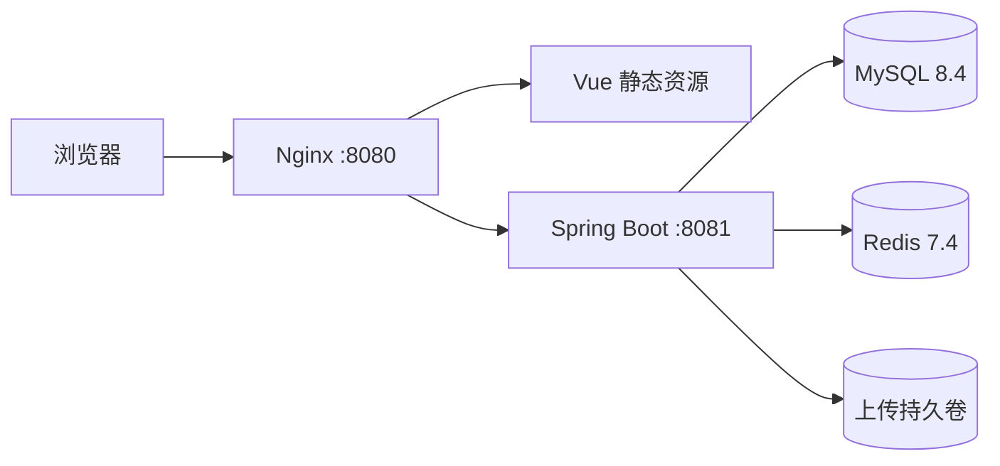

# 系统设计

## 关键决策

- 单仓库降低课程交付和版本对应成本。
- Nginx 是唯一公开入口；后端、MySQL、Redis 不映射宿主端口。
- MySQL 是事实源。浏览量先写 MySQL，Redis 只做热门辅助，避免缓存故障影响阅读。
- Spring Session Redis 保存登录态；Cookie 为 HttpOnly、SameSite=Lax。
- Flyway 是唯一结构迁移入口，保证新环境与恢复环境结构一致。
- 管理操作写入审计表，富文本进入数据库前由 Jsoup 白名单清洗。

## 回滚

应用通过小粒度 Git 提交回滚；数据库迁移采用向前修复，不删除已发布迁移。上线前先备份数据库和上传卷。当前仅承诺本地 Docker 运行。
